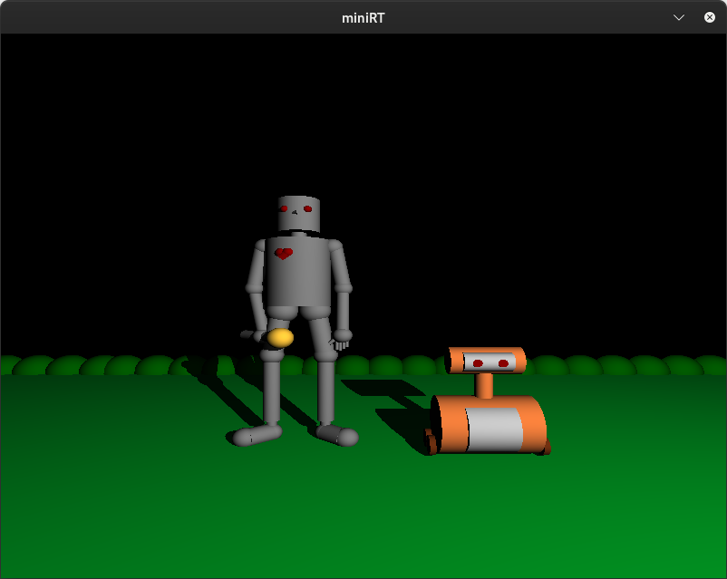
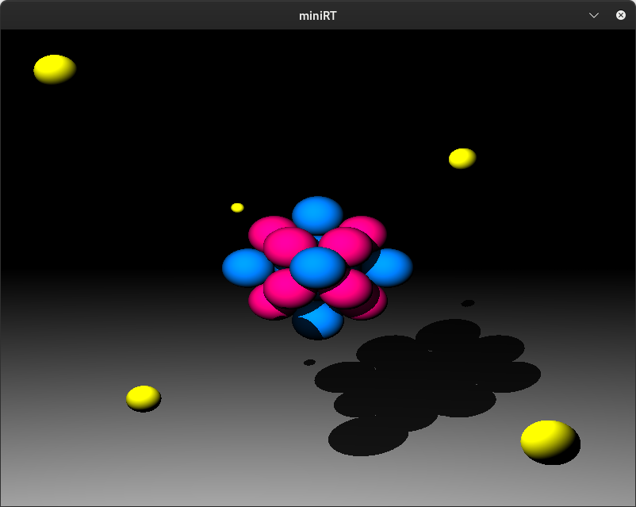
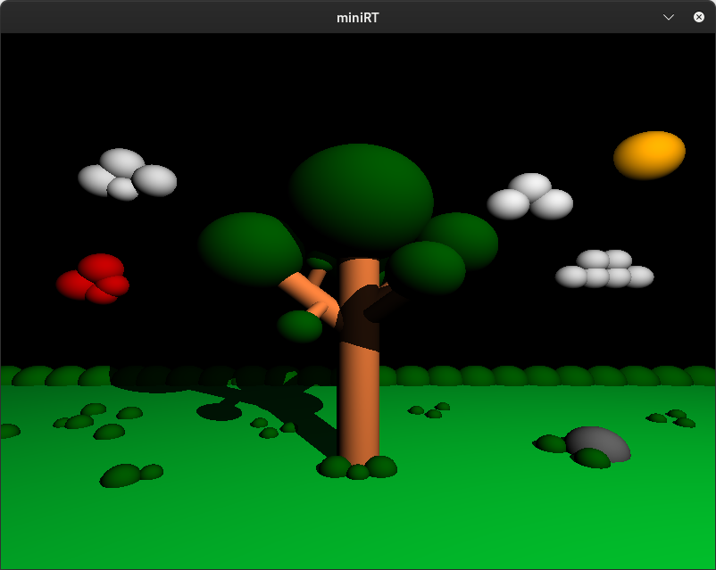
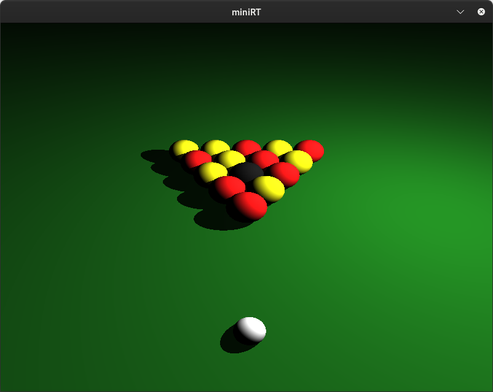

# miniRT (Ray Tracer)

A minimal real‑time ray tracer written in C using the MiniLibX (X11) library. It parses simple scene files (`.rt`) and renders spheres, planes, and cylinders with ambient and point lighting.

## Features
- Basic primitives: sphere (`sp`), plane (`pl`), cylinder (`cy`)
- Camera with configurable position, direction, and FOV
- Lighting: ambient (`A`) and point light (`L`)
- Simple shading with shadows
- ESC to quit, window close button supported

## Project Layout
- [src](src): application sources and [src/Makefile](src/Makefile)
- [src/parsing](src/parsing): scene file parsing
- [src/render](src/render): ray generation, intersections, shading
- [src/scenes](src/scenes): example `.rt` scenes
- [minilibx-linux](minilibx-linux): MiniLibX (Linux/X11) submodule

## Requirements (Linux)
- Build tools: `gcc`, `make`

## Build MiniLibX
Build the bundled MiniLibX once. This creates `libmlx.a`/`libmlx_Linux.a`.

```bash
cd minilibx-linux
make
cd -
```

## Build miniRT
There are two common ways to link MiniLibX.

1) Using the defaults (MiniLibX installed globally):
- The current [src/Makefile](src/Makefile) expects MiniLibX headers in `/usr/include/minilibx-linux` and links with `-lmlx`.
- If you installed MiniLibX headers and library system-wide, simply run:

```bash
cd src
make
```

2) Linking against the local `minilibx-linux` folder:

```bash
cd src
make 
```

## Run
After a successful build, the binary is generated as `miniRT` inside `src`.

```bash
./miniRT parsing/scenes/sphere.rt
```

Example scenes you can try:
- `scenes/atome.rt`
- `scenes/friend.rt`
- `scenes/tree.rt`
- `scenes/billard.rt`

Window controls:
- ESC — exit
- Window close button — exit

## Scene Format (.rt)
Each line defines an element. Supported identifiers and parameter formats:

- `A <intensity> <R,G,B>`
  - Global ambient light with intensity in `[0,1]` and color components `0..255`.
  - Example: `A 0.3 200,150,255`

- `C <x,y,z> <dir_x,dir_y,dir_z> <fov>`
  - Camera position, normalized direction components in `[-1,1]`, and FOV in degrees `[0..180]`.
  - Example: `C 5,8,12 -0.3,-0.4,-0.8 90`

- `L <x,y,z> <brightness> <R,G,B>`
  - Point light with brightness in `[0,1]` and RGB `0..255`.
  - Example: `L -15,20,10 0.8 255,200,150`

- `sp <x,y,z> <diameter> <R,G,B>`
  - Sphere center, diameter (> 0), and color.
  - Example: `sp 0,0,0 1.5 255,50,150`

- `pl <x,y,z> <nx,ny,nz> <R,G,B>`
  - Plane point, normal vector components in `[-1,1]`, and color.
  - Example: `pl 0,-3,0 0,1,0 80,40,120`

- `cy <x,y,z> <ax,ay,az> <diameter> <height> <R,G,B>`
  - Cylinder center, axis vector components in `[-1,1]`, diameter (> 0), height (> 0), and color.
  - Example: `cy -3,-3,0 0,1,0 0.5 4 100,200,255`

General rules:
- Values are space-separated; vectors and colors use commas between components.
- Out-of-range values or malformed lines produce an error and exit.

## Troubleshooting
- Linker errors for `-lmlx` or X11 usually indicate MiniLibX not built/linked correctly or missing X11 dev packages. Recheck the Steps above.
- If linking against the local MiniLibX, prefer `-lmlx_Linux` and include `-lz` as shown.
- If the program exits with an error about the scene, validate your `.rt` file formatting and ranges.

## Screenshots
Here are sample renders produced by miniRT:









